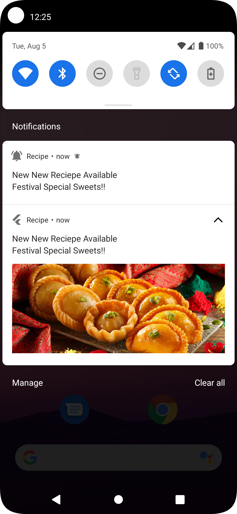
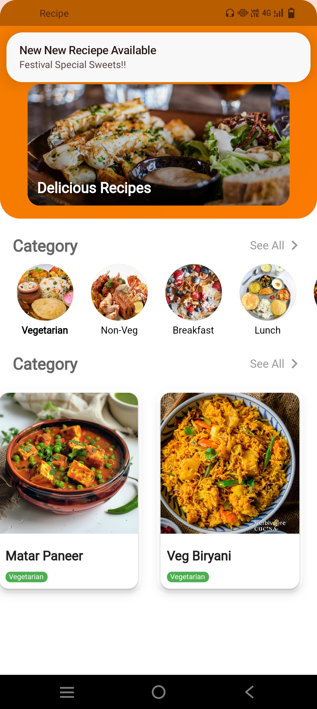
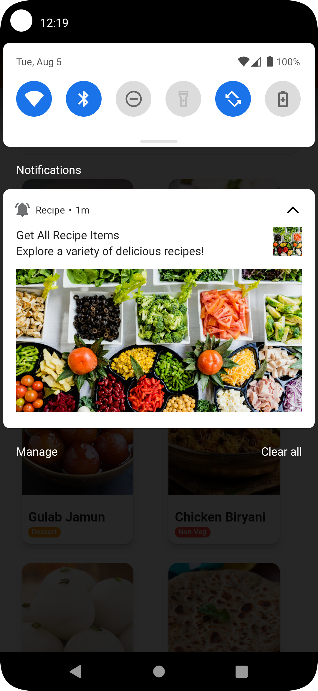
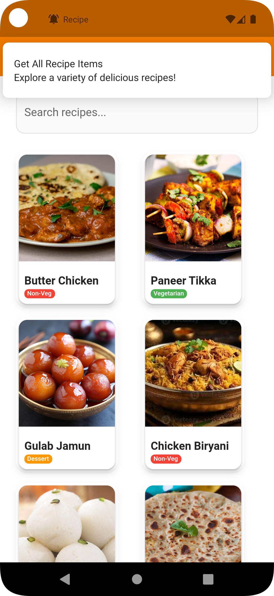

# Indian Recipe App with Firebase Integration, [ Local & Push Notifications ]

A complete **Flutter Indian Recipe App** featuring **authentic Indian recipes**, **modern UI**, **real-time Firebase Firestore**, **Local Notifications**, and **Firebase Cloud Messaging (Push Notifications)**.

## Features

### Recipe Management
- **Authentic Indian Recipes** with details
- **Categories**: Vegetarian, Non-Veg, Dessert, Beverage
- **Search & Filter** functionality
- **Image Upload** using Firebase Storage
- **Real-Time Sync** with Firebase Firestore

### 🔔 Notifications
- **Local Notifications**:
  - Daily recipe reminders
  - Scheduled notifications
- **Push Notifications (FCM)**:
  - Receive recipe updates
  - Handles foreground, background, and terminated states

### Recipe Details
- Ingredients & step-by-step instructions
- High-quality images
- Image Carousel for multiple photos

---

## Installation
1. Clone Repository
   ```bash
   git clone https://github.com/bhartisahu09/Recipe_App_Firebase
   cd recipe_app
   ```
2. **Install dependencies**
   ```bash
   flutter pub get
   ```

3. **Firebase Setup**
   - Create a Firebase project at [Firebase Console](https://console.firebase.google.com/)
   - Configure your app with Firebase using FlutterFire CLI:
     ```bash
     dart pub global activate flutterfire_cli
     flutterfire configure --project=your-firebase-project-id
     ```
   - Or manually update the `firebase_options.dart` file with your Firebase project details
   - Enable Firestore Database in the Firebase console
   - Enable Firebase Storage for image uploads

4. **Run the app**
   ```bash
   flutter run
   ```

## Screenshots
 
| FCM Push Notification (Background, Terminate) | FCM Push Notification (Foreground) |
|:---:|:---:|
| |   |

| Local Notifications | Local Notification (Foreground) |
|:---:|:---:|
| |  |

## Project Structure

```
lib/
├── models/
│   ├── category_model.dart
│   └── recipe_model.dart
├── provider/
│   └── recipe_provider.dart
├── screens/
│   ├── home_screen.dart
│   ├── recipe_items.dart
│   ├── see_all_items.dart
│   └── recipe_detail_screen.dart
├── services/
│   ├── firebase_options.dart
│   ├── notification_service.dart    # Local Notifications & Push Notifications
├── widgets/
│   ├── add_recipe_screen.dart
│   └── app_category_screen.dart
└── main.dart
```
## Notifications Integration

- **Local Notifications** (flutter_local_notifications)
- Schedule recipe reminders
- Display custom notifications

## Push Notifications (Firebase Cloud Messaging)
- **Handles foreground, background, and terminated states**

## Indian Recipe Categories

- **Vegetarian** (Green) - Plant-based Indian dishes
- **Non-Veg** (Red) - Meat and fish Indian curries  
- **Dessert** (Orange) - Traditional Indian sweets
- **Beverage** (Purple) - Hot and cold drinks

## Dependencies

- **provider** ^6.1.1 - State management
- **firebase_core** ^2.24.2 - Firebase core functionality
- **firebase_auth** ^4.15.3 - Firebase authentication
- **cloud_firestore** ^4.13.6 - Firestore database
- **firebase_storage** ^11.5.6 - Firebase storage for images
- **carousel_slider** ^5.1.1 - Image carousel slider
- **flutter_local_notifications** ^18.0.1 - Local notifications
- **path_provider** ^2.1.3 - File system paths
- **http** ^1.1.0 - HTTP requests
- **firebase_messaging** ^14.7.3 - Push notifications

## Future Enhancements

- Favorites & Recipe Sharing
- Cooking Timer
- Nutritional Info
- Offline Mode
- Ratings & Reviews
- Regional cuisines
- Festival-specific recipes
